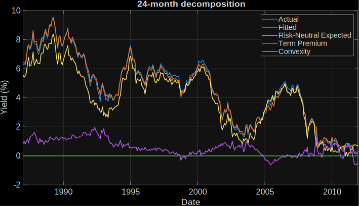

# Term Premium Modelling

## Overview

This repository contains a MATLAB® implementation of the Adrian-Crump-Moench (ACM) term premium model, as described in:

* Pricing the Term Structure with Linear Regressions, Tobias Adrian,
Richard K. Crump, and Emanuel Moench, Federal Reserve Bank of New York
Staff Reports, no. 340, August 2008; revised April 2013, JEL
classification: G10, G12.

After a long regime of near-zero base interest rates, the return of base 
interest rates in developed economies to more realistic historical levels 
has inspired a greater interest in term-premium modelling methodologies.

The term premium is the additional compensation, or premium, associated 
with an investment in a long-term bond compared with rolling over a 
sequence of short-term bonds. For example, when investing for a period of 
10 years, an investor could purchase a 10-year bond, or purchase a 
sequence of ten 1-year bonds. The term premium compensates long-term bond 
investors for the additional interest rate risk they incur. The interest 
rate risk takes the following form: if an investor is tied into a long-term 
bond and the base interest rate rises, then they miss out on the higher 
returns available on short-term bonds. No credit risk is assumed in these 
models, as they are generally used for government-issued securities.

During a near-zero interest rate regime, such as the period from the global
 financial crisis (2007-2008) to the end of 2021, long-term bonds are more 
attractive due to their higher return. As interest rates increase, 
short-term bonds become more competitive and long-term bonds lose some of 
their appeal. The dynamics of the term premium provide central bankers and 
investors with more quantitative insight into these market processes.

## Installation and Getting Started
The code and examples are provided in a MATLAB project.
1. Double-click on the project archive (`ACM.mlproj`) to extract it using MATLAB.
2. With MATLAB open, navigate to the newly-created project folder and double-click on the project file (`ACM.prj`) to open the project.
3. The example file is the live script `TermPremiumModelling.mlx` within the project.
4. The main functions are `fitACM.m` (containing the overall model) and `pdynamics.m` (evaluates the pricing-factor dynamics).

### [MathWorks&reg;](https://www.mathworks.com) Product Requirements

This example was developed using MATLAB release R2022b, and is compatible with release R2022b onwards.
- [MATLAB&reg;](https://www.mathworks.com/products/matlab.html)
- [Econometrics Toolbox&trade;](https://www.mathworks.com/products/econometrics.html)
- [Optimization Toolbox&trade;](https://www.mathworks.com/products/optimization.html)
- [Statistics and Machine Learning Toolbox&trade;](https://www.mathworks.com/products/statistics.html)

## License
The license is available in the [LICENSE.txt](LICENSE.txt) file in this GitHub repository.

## References

1.	[Pricing the Term Structure with Linear Regressions](https://www.newyorkfed.org/medialibrary/media/research/staff_reports/sr340.pdf), Tobias Adrian, Richard K. Crump, and Emanuel Moench, Federal Reserve Bank of New York Staff Reports, no. 340, August 2008; revised April 2013, JEL classification: G10, G12
2.	[Bank of England Working Paper No. 518: Evaluating the robustness of UK term structure decompositions using linear regression methods](https://www.bankofengland.co.uk/-/media/boe/files/working-paper/2014/evaluating-the-robustness-of-uk-term-structure-decompositions-using-linear-regression-methods.pdf), Sheheryar Malik and Andrew Meldrum
3.	[Bond Risk Premia](https://web.stanford.edu/~piazzesi/cp.pdf), John H. Cochrane and Monika Piazzesi
4.	[Term premium dynamics in an emerging market: Risk, liquidity, and behavioral factors](https://www.sciencedirect.com/science/article/abs/pii/S1057521922003052), Cenk C. Karahan, Emre Soykök, International Review of Financial Analysis, Volume 84, November 2022, 102355
5.	[Term premium in emerging market sovereign yields: Role of common and country specific factors](https://www.sciencedirect.com/science/article/pii/S1303070120300378), Ibrahim Ozbek, Irem Talasl, Central Bank Review, Volume 20, Issue 4, December 2020, Pages 169-182
6.  [The U.S. Treasury yield curve: 1961 to the present](https://www.sciencedirect.com/science/article/abs/pii/S0304393207000840), Refet S. Gürkaynak, Brian Sack, Jonathan H. Wright, Journal of Monetary Economics, Volume 54, Issue 8, November 2007, Pages 2291-2304
7.  [Federal Reserve Economic Research Data](https://www.federalreserve.gov/econresdata/researchdata/feds200628.xls), accessed July 2025.

_Copyright 2025 The MathWorks, Inc._