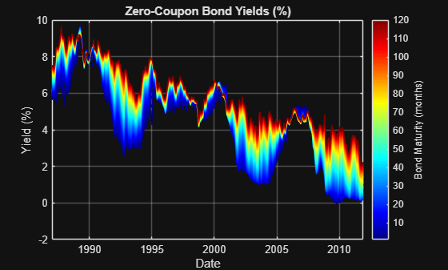
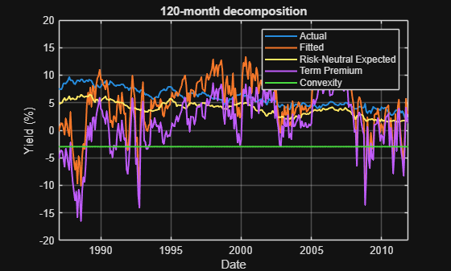

<a id="T_0428AC80"></a>

# <span style="color:rgb(213,80,0)">**Term\-Premium Modelling using the ACM Model**</span>

After a long regime of near\-zero base interest rates, the return of base interest rates in developed economies to more realistic historical levels has inspired a greater interest in term\-premium modelling methodologies.


The *term premium* is the additional compensation, or premium, associated with an investment in a long\-term bond compared with rolling over a sequence of short\-term bonds. For example, when investing for a period of 10 years, an investor could purchase a 10\-year bond, or purchase a sequence of ten 1\-year bonds. The term premium compensates long\-term bond investors for the additional interest rate risk they incur. The interest rate risk takes the following form: if an investor is tied into a long\-term bond and the base interest rate rises, then they miss out on the higher returns available on short\-term bonds. No credit risk is assumed in these models, as they are generally used for government\-issued securities.


During a near\-zero interest rate regime, such as the period from the global financial crisis (2007\-2008) to the end of 2021, long\-term bonds are more attractive due to their higher return. As interest rates increase, short\-term bonds become more competitive and long\-term bonds lose some of their appeal. The dynamics of the term premium provide central bankers and investors with more quantitative insight into these market processes.


This script demonstrates how to fit the Adrian\-Crump\-Moench (ACM) term\-premium model to a set of yield curves, based on the ACM 2013 paper.

-  [Pricing the Term Structure with Linear Regressions](https://www.newyorkfed.org/medialibrary/media/research/staff_reports/sr340.pdf), Tobias Adrian, Richard K. Crump, and Emanuel Moench, Federal Reserve Bank of New York Staff Reports, no. 340, August 2008; revised April 2013, JEL classification: G10, G12. 

The yield curve data used in this example comes from the [Federal Reserve Economic Research Data](https://www.federalreserve.gov/econres.htm) portal ([file link](https://www.federalreserve.gov/econresdata/researchdata/feds200628.xls)), and was last accessed in July 2025.


For further references and background information, please see the [References](#H_B95A1FA7) section below.

<!-- Begin Toc -->

## Table of Contents
&emsp;[Download the data used in the ACM 2013 paper.](#H_03976C9A)
&emsp;[Import the ACM 2013 data as a timetable.](#H_91F85D56)
&emsp;[Extract the Svensson model parameters and dates matching the range used in ACM 2013.](#H_99F7507D)
&emsp;[Construct a collection of yield curves using the Svensson model.](#H_7BC32953)
&emsp;[Visualize the yield curves.](#H_7F5FCC80)
&emsp;[Specify the model options.](#H_15195F2B)
&emsp;[Fit the model.](#H_F8A071D0)
&emsp;[Plot the 2\-year and 10\-year decompositions.](#H_E4C85F1B)
&emsp;[References](#H_B95A1FA7)
&emsp;[Local functions.](#H_B51BE7A8)
 
<!-- End Toc -->
<a id="H_03976C9A"></a>

# Download the data used in the ACM 2013 paper.
```matlab
filename = "feds200628.xls";

try
    if ~isfile( filename )
        websave( filename, "https://www.federalreserve.gov/econresdata/researchdata/feds200628.xls" );
    end % if
catch 
    error( "TermPremiumModelling:DownloadAndSaveFailed", ...
        "Unable to download and/or save data. Check your internet " + ...
        "connection and file access permissions." )
end % try/catch
```
<a id="H_91F85D56"></a>

# Import the ACM 2013 data as a timetable.
```matlab
svenData = readtable( filename );
svenData.(1) = datetime( svenData.(1) );
svenData = table2timetable( svenData );
svenData.Properties.DimensionNames(1) = "Date";
svenData = sortrows( svenData );
disp( head( svenData ) )
```

```matlabTextOutput
       Date        SVENY01    SVENY02    SVENY03    SVENY04    SVENY05    SVENY06    SVENY07    SVENY08    SVENY09    SVENY10    SVENY11    SVENY12    SVENY13    SVENY14    SVENY15    SVENY16    SVENY17    SVENY18    SVENY19    SVENY20    SVENY21    SVENY22    SVENY23    SVENY24    SVENY25    SVENY26    SVENY27    SVENY28    SVENY29    SVENY30    SVENPY01    SVENPY02    SVENPY03    SVENPY04    SVENPY05    SVENPY06    SVENPY07    SVENPY08    SVENPY09    SVENPY10    SVENPY11    SVENPY12    SVENPY13    SVENPY14    SVENPY15    SVENPY16    SVENPY17    SVENPY18    SVENPY19    SVENPY20    SVENPY21    SVENPY22    SVENPY23    SVENPY24    SVENPY25    SVENPY26    SVENPY27    SVENPY28    SVENPY29    SVENPY30    SVENF01    SVENF02    SVENF03    SVENF04    SVENF05    SVENF06    SVENF07    SVENF08    SVENF09    SVENF10    SVENF11    SVENF12    SVENF13    SVENF14    SVENF15    SVENF16    SVENF17    SVENF18    SVENF19    SVENF20    SVENF21    SVENF22    SVENF23    SVENF24    SVENF25    SVENF26    SVENF27    SVENF28    SVENF29    SVENF30    SVEN1F01    SVEN1F04    SVEN1F09    BETA0      BETA1       BETA2     BETA3     TAU1       TAU2  
    ___________    _______    _______    _______    _______    _______    _______    _______    _______    _______    _______    _______    _______    _______    _______    _______    _______    _______    _______    _______    _______    _______    _______    _______    _______    _______    _______    _______    _______    _______    _______    ________    ________    ________    ________    ________    ________    ________    ________    ________    ________    ________    ________    ________    ________    ________    ________    ________    ________    ________    ________    ________    ________    ________    ________    ________    ________    ________    ________    ________    ________    _______    _______    _______    _______    _______    _______    _______    _______    _______    _______    _______    _______    _______    _______    _______    _______    _______    _______    _______    _______    _______    _______    _______    _______    _______    _______    _______    _______    _______    _______    ________    ________    ________    ______    ________    _______    _____    _______    _______

    14-Jun-1961    2.9825     3.3771      3.553     3.6439     3.6987     3.7351     3.7612       NaN        NaN        NaN        NaN        NaN        NaN        NaN        NaN        NaN        NaN        NaN        NaN        NaN        NaN        NaN        NaN        NaN        NaN        NaN        NaN        NaN        NaN        NaN       3.0025      3.3973      3.5724      3.6627      3.7169       3.753      3.7787       NaN         NaN         NaN         NaN         NaN         NaN         NaN         NaN         NaN         NaN         NaN         NaN         NaN         NaN         NaN         NaN         NaN         NaN         NaN         NaN         NaN         NaN         NaN       3.5492     3.8825     3.9149     3.9174     3.9176     3.9176     3.9176       NaN        NaN        NaN        NaN        NaN        NaN        NaN        NaN        NaN        NaN        NaN        NaN        NaN        NaN        NaN        NaN        NaN        NaN        NaN        NaN        NaN        NaN        NaN       3.8067      3.9562       NaN       3.9176      -1.278    -1.9494      0      0.33922    -999.99
    15-Jun-1961    2.9941     3.4137     3.5981      3.693     3.7501     3.7882     3.8154       NaN        NaN        NaN        NaN        NaN        NaN        NaN        NaN        NaN        NaN        NaN        NaN        NaN        NaN        NaN        NaN        NaN        NaN        NaN        NaN        NaN        NaN        NaN       3.0141      3.4339      3.6175      3.7117      3.7683       3.806      3.8328       NaN         NaN         NaN         NaN         NaN         NaN         NaN         NaN         NaN         NaN         NaN         NaN         NaN         NaN         NaN         NaN         NaN         NaN         NaN         NaN         NaN         NaN         NaN       3.5997      3.946     3.9763     3.9784     3.9785     3.9785     3.9785       NaN        NaN        NaN        NaN        NaN        NaN        NaN        NaN        NaN        NaN        NaN        NaN        NaN        NaN        NaN        NaN        NaN        NaN        NaN        NaN        NaN        NaN        NaN       3.8694      4.0183       NaN       3.9785     -1.2574    -2.2476      0      0.32577    -999.99
    16-Jun-1961    3.0012     3.4142     3.5994     3.6953     3.7531     3.7917     3.8192       NaN        NaN        NaN        NaN        NaN        NaN        NaN        NaN        NaN        NaN        NaN        NaN        NaN        NaN        NaN        NaN        NaN        NaN        NaN        NaN        NaN        NaN        NaN       3.0213      3.4346      3.6188       3.714      3.7713      3.8094      3.8365       NaN         NaN         NaN         NaN         NaN         NaN         NaN         NaN         NaN         NaN         NaN         NaN         NaN         NaN         NaN         NaN         NaN         NaN         NaN         NaN         NaN         NaN         NaN       3.5957     3.9448     3.9811     3.9841     3.9843     3.9843     3.9844       NaN        NaN        NaN        NaN        NaN        NaN        NaN        NaN        NaN        NaN        NaN        NaN        NaN        NaN        NaN        NaN        NaN        NaN        NaN        NaN        NaN        NaN        NaN       3.8634      4.0242       NaN       3.9844     -1.4295     -1.885      0      0.34882    -999.99
    19-Jun-1961    2.9949     3.4386     3.6252     3.7199     3.7768     3.8147     3.8418       NaN        NaN        NaN        NaN        NaN        NaN        NaN        NaN        NaN        NaN        NaN        NaN        NaN        NaN        NaN        NaN        NaN        NaN        NaN        NaN        NaN        NaN        NaN        3.015      3.4589      3.6446      3.7387      3.7951      3.8327      3.8595       NaN         NaN         NaN         NaN         NaN         NaN         NaN         NaN         NaN         NaN         NaN         NaN         NaN         NaN         NaN         NaN         NaN         NaN         NaN         NaN         NaN         NaN         NaN       3.6447     3.9842     4.0035     4.0043     4.0044     4.0044     4.0044       NaN        NaN        NaN        NaN        NaN        NaN        NaN        NaN        NaN        NaN        NaN        NaN        NaN        NaN        NaN        NaN        NaN        NaN        NaN        NaN        NaN        NaN        NaN       3.9196      4.0447       NaN       4.0044    -0.72331    -3.3107      0      0.28209    -999.99
    20-Jun-1961    2.9833     3.4101     3.5986     3.6952     3.7533     3.7921     3.8198       NaN        NaN        NaN        NaN        NaN        NaN        NaN        NaN        NaN        NaN        NaN        NaN        NaN        NaN        NaN        NaN        NaN        NaN        NaN        NaN        NaN        NaN        NaN       3.0034      3.4303      3.6178      3.7137      3.7713      3.8096       3.837       NaN         NaN         NaN         NaN         NaN         NaN         NaN         NaN         NaN         NaN         NaN         NaN         NaN         NaN         NaN         NaN         NaN         NaN         NaN         NaN         NaN         NaN         NaN       3.5845     3.9552      3.984     3.9857     3.9858     3.9858     3.9858       NaN        NaN        NaN        NaN        NaN        NaN        NaN        NaN        NaN        NaN        NaN        NaN        NaN        NaN        NaN        NaN        NaN        NaN        NaN        NaN        NaN        NaN        NaN       3.8732      4.0257       NaN       3.9858    -0.90043    -2.8448      0      0.31032    -999.99
    21-Jun-1961    2.9993     3.4236     3.6132     3.7107     3.7694     3.8085     3.8364       NaN        NaN        NaN        NaN        NaN        NaN        NaN        NaN        NaN        NaN        NaN        NaN        NaN        NaN        NaN        NaN        NaN        NaN        NaN        NaN        NaN        NaN        NaN       3.0197      3.4441      3.6326      3.7294      3.7875      3.8262      3.8538       NaN         NaN         NaN         NaN         NaN         NaN         NaN         NaN         NaN         NaN         NaN         NaN         NaN         NaN         NaN         NaN         NaN         NaN         NaN         NaN         NaN         NaN         NaN        3.593     3.9702     4.0019     4.0039     4.0041     4.0041     4.0041       NaN        NaN        NaN        NaN        NaN        NaN        NaN        NaN        NaN        NaN        NaN        NaN        NaN        NaN        NaN        NaN        NaN        NaN        NaN        NaN        NaN        NaN        NaN       3.8844      4.0444       NaN       4.0041    -0.97167    -2.7091      0      0.31877    -999.99
    22-Jun-1961    2.9837     3.4036     3.5976     3.6981     3.7587      3.799     3.8279       NaN        NaN        NaN        NaN        NaN        NaN        NaN        NaN        NaN        NaN        NaN        NaN        NaN        NaN        NaN        NaN        NaN        NaN        NaN        NaN        NaN        NaN        NaN        3.004      3.4239      3.6167      3.7164      3.7763      3.8162      3.8446       NaN         NaN         NaN         NaN         NaN         NaN         NaN         NaN         NaN         NaN         NaN         NaN         NaN         NaN         NaN         NaN         NaN         NaN         NaN         NaN         NaN         NaN         NaN       3.5548     3.9583     3.9977     4.0007     4.0009     4.0009     4.0009       NaN        NaN        NaN        NaN        NaN        NaN        NaN        NaN        NaN        NaN        NaN        NaN        NaN        NaN        NaN        NaN        NaN        NaN        NaN        NaN        NaN        NaN        NaN       3.8593      4.0411       NaN       4.0009    -0.99291    -2.6202      0      0.33522    -999.99
    23-Jun-1961    2.9749     3.3706     3.5725     3.6816     3.7478     3.7921     3.8237       NaN        NaN        NaN        NaN        NaN        NaN        NaN        NaN        NaN        NaN        NaN        NaN        NaN        NaN        NaN        NaN        NaN        NaN        NaN        NaN        NaN        NaN        NaN       2.9951      3.3908      3.5913      3.6991      3.7645      3.8081      3.8391       NaN         NaN         NaN         NaN         NaN         NaN         NaN         NaN         NaN         NaN         NaN         NaN         NaN         NaN         NaN         NaN         NaN         NaN         NaN         NaN         NaN         NaN         NaN       3.4927      3.928     4.0021     4.0121     4.0133     4.0135     4.0135       NaN        NaN        NaN        NaN        NaN        NaN        NaN        NaN        NaN        NaN        NaN        NaN        NaN        NaN        NaN        NaN        NaN        NaN        NaN        NaN        NaN        NaN        NaN        3.801      4.0535       NaN       4.0135      -1.381    -1.7641      0      0.42238    -999.99
```

<a id="H_99F7507D"></a>

# Extract the Svensson model parameters and dates matching the range used in ACM 2013.

Extrapolate where needed so that we have one data point for each month.

```matlab
tr = timerange( datetime( 1987, 1, 1 ), datetime( 2011, 12, 31 ) );
svenData = svenData( tr, ["SVENY02", "BETA0", "BETA1", "BETA2", "BETA3", "TAU1", "TAU2"] );
svenData = retime( svenData, "monthly", "nearest" );
svenData(end, :) = [];
disp( head( svenData ) )
```

```matlabTextOutput
       Date        SVENY02    BETA0      BETA1      BETA2     BETA3      TAU1       TAU2  
    ___________    _______    ______    _______    _______    ______    _______    _______

    01-Jan-1987    6.3105     8.8124    -3.2289    -620.33    618.06     2.0111     2.0066
    01-Feb-1987    6.2804      8.694    -2.9329    -620.37    618.01     2.0756      2.073
    01-Mar-1987    6.2788     8.4822    -2.8846     -620.2    618.19     1.9104     1.9065
    01-Apr-1987    6.6066     8.7423    -2.8986    -620.06    618.33     1.8327     1.8295
    01-May-1987    7.3905     8.9959    -3.8751    -619.14    619.26    0.84575    0.84261
    01-Jun-1987    7.5958     9.1252    -3.3133    -619.09    619.31     1.2263     1.2227
    01-Jul-1987    7.3184     9.1577    -3.1625    -619.47    618.93     1.4869     1.4848
    01-Aug-1987    7.4298     9.5847    -3.5482    -619.39       619     1.7697     1.7671
```

<a id="H_7BC32953"></a>

# Construct a collection of yield curves using the Svensson model.

Extract the Svensson model parameters.

```matlab
Beta0 = svenData.BETA0;
Beta1 = svenData.BETA1;
Beta2 = svenData.BETA2;
Beta3 = svenData.BETA3;
Tau1 = svenData.TAU1;
Tau2 = svenData.TAU2;
```

Define the required bond maturities, expressed in years from one month to ten years.

```matlab
monthlyMaturities = 1:120;
annualMaturities = monthlyMaturities / 12;
```

Compute yields using the Svensson model:


    ,


where:

-       is the zero\-coupon bond yield (%), 
-       and     ,      are the parameters of the Svensson model, 
-       is the maturity in years. 
```matlab
f1 = Tau1 ./ annualMaturities;
f2 = 1 - exp( (-1) ./ f1 );
f3 = Tau2 ./ annualMaturities;
f4 = 1 - exp( (-1) ./ f3 );
yields = Beta0 + Beta1 .* f1 .* f2 + Beta2 .* (f1 .* f2 + f2 - 1) + Beta3 .* (f3 .* f4 + f4 - 1);
```

Store the yields in a timetable.

```matlab
yields = array2timetable( yields, "RowTimes", svenData.Date, ...
    "VariableNames", string( monthlyMaturities ) );
yields.Properties.DimensionNames(1) = svenData.Properties.DimensionNames(1);
```

Write down an estimate for the short\-term interest rate using the first yield curve.

```matlab
stir = array2timetable( yields{:, 1}, ...
    "RowTimes", yields.Date, ...
    "VariableNames", "ShortTermRate" );
```

Write down the number of maturities.

```matlab
numMaturities = width( yields );
```
<a id="H_7F5FCC80"></a>

# Visualize the yield curves.
```matlab
figure
ax = axes();
plot( ax, yields.Date, yields.Variables )
xlabel( ax, "Date" )
ylabel( ax, "Yield (%)" )
title( ax, "Zero-Coupon Bond Yields (%)" )
grid( ax, "on" )
ax.ColorOrder = jet( numMaturities );
colormap( ax, jet( numMaturities ) )
ax.CLim = [1, numMaturities];
c = colorbar( ax );
ylabel( c, "Bond Maturity (months)" )
```

<center></center>

<a id="H_15195F2B"></a>

# Specify the model options.

Number of principal components to use.

```matlab
numComponents = 5;
```

Specify the maturity options, in months.

```matlab
maturities = 1:120;
```

The maturities to use for computing the principal components of the yield matrix.

```matlab
maturitiesPCA = 3:120; 
```

The maturities to use for computing the excess returns.

```matlab
maturitiesRX = [6:6:60, 84, 120];
```
<a id="H_F8A071D0"></a>

# Fit the model.

See [`fitACM`](<matlab: edit fitACM>) and [`pdynamics`](<matlab: edit pdynamics>) for details.

```matlab
decomposition = fitACM( yields, stir, maturities, ...
    "NumComponents", numComponents, ...
    "FactorMaturities", maturitiesPCA, ...
    "ExcessReturnMaturities", maturitiesRX );
```
<a id="H_E4C85F1B"></a>
<a id="T_0428AC80"></a>
<center></center>


```matlab
figure
ax = axes();
plotDecomposition( ax, yields, decomposition, 120 )
```

<center></center>

<a id="H_B95A1FA7"></a>

# References
-  [Pricing the Term Structure with Linear Regressions](https://www.newyorkfed.org/medialibrary/media/research/staff_reports/sr340.pdf), Tobias Adrian, Richard K. Crump, and Emanuel Moench, Federal Reserve Bank of New York Staff Reports, no. 340, August 2008; revised April 2013, JEL classification: G10, G12 
-  [Bank of England Working Paper No. 518: Evaluating the robustness of UK term structure decompositions using linear regression methods](https://www.bankofengland.co.uk/-/media/boe/files/working-paper/2014/evaluating-the-robustness-of-uk-term-structure-decompositions-using-linear-regression-methods.pdf), Sheheryar Malik and Andrew Meldrum 
-  [Bond Risk Premia](<https://web.stanford.edu/~piazzesi/cp.pdf>), John H. Cochrane and Monika Piazzesi 
-  [Term premium dynamics in an emerging market: Risk, liquidity, and behavioral factors](https://www.sciencedirect.com/science/article/abs/pii/S1057521922003052), Cenk C. Karahan, Emre Soykök, International Review of Financial Analysis, Volume 84, November 2022, 102355 
-  [Term premium in emerging market sovereign yields: Role of common and country specific factors](https://www.sciencedirect.com/science/article/pii/S1303070120300378), Ibrahim Ozbek, Irem Talasl, Central Bank Review, Volume 20, Issue 4, December 2020, Pages 169\-182 
-  [The U.S. Treasury yield curve: 1961 to the present](https://www.sciencedirect.com/science/article/abs/pii/S0304393207000840), Refet S. Gürkaynak, Brian Sack, Jonathan H. Wright, Journal of Monetary Economics, Volume 54, Issue 8, November 2007, Pages 2291\-2304 
-  [Federal Reserve Economic Research Data](https://www.federalreserve.gov/econresdata/researchdata/feds200628.xls), accessed July 2025. 
<a id="H_B51BE7A8"></a>

# Local functions.
<a id="M_701F3CFE"></a>
```matlab
function plotDecomposition( ax, yields, decomposition, numMonths )

plot( ax, yields.Date, yields{:, numMonths}, "LineWidth", 1.5 )
hold on
plot( ax, decomposition.FittedYields.Date, decomposition.FittedYields{:, numMonths}, "LineWidth", 1.5 )
plot( ax, decomposition.RiskNeutralExpectedValues.Date, decomposition.RiskNeutralExpectedValues{:, numMonths}, "LineWidth", 1.5 )
plot( ax, decomposition.TermPremium.Date, decomposition.TermPremium{:, numMonths}, "LineWidth", 1.5 )
plot( ax, decomposition.Convexity.Date, decomposition.Convexity{:, numMonths}, "LineWidth", 1.5 )
xlabel( ax, "Date" )
ylabel( ax, "Yield (%)" )
title( ax, string( numMonths ) + "-month decomposition" )
grid( ax, "on" )
legend( ax, ["Actual", "Fitted", "Risk-Neutral Expected", "Term Premium", "Convexity"] )

end % plotDecomposition
```
